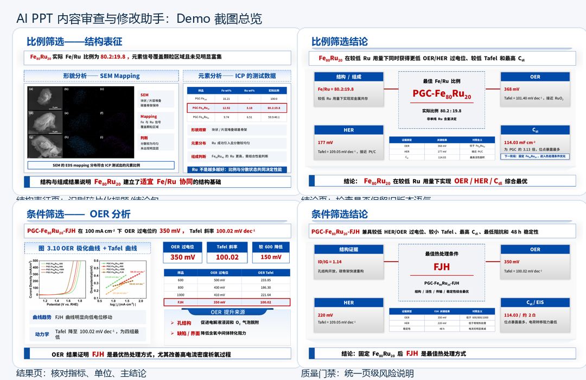
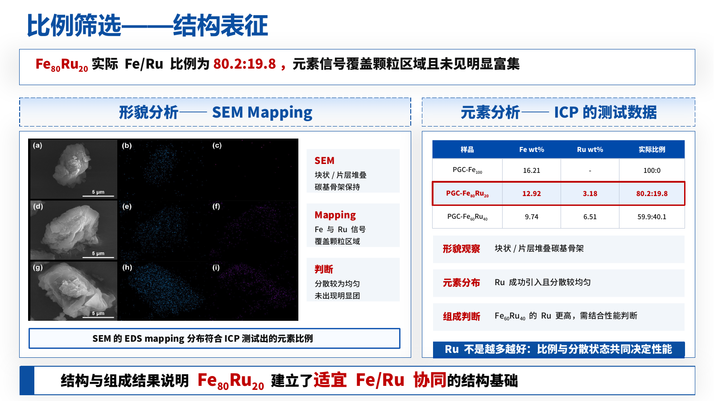
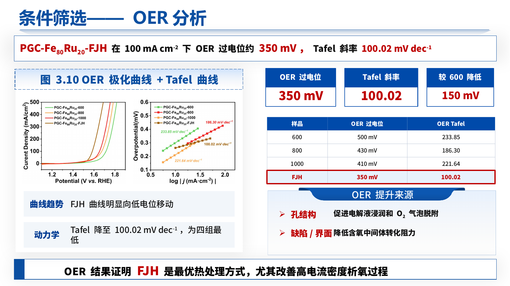
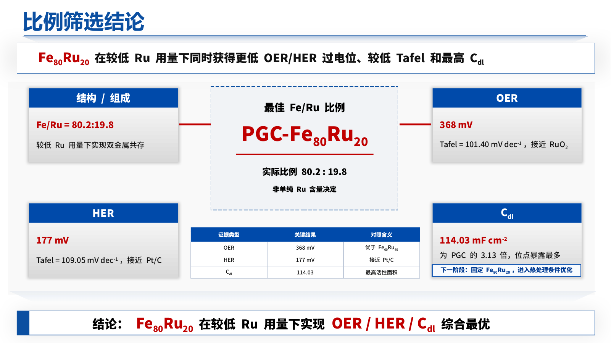
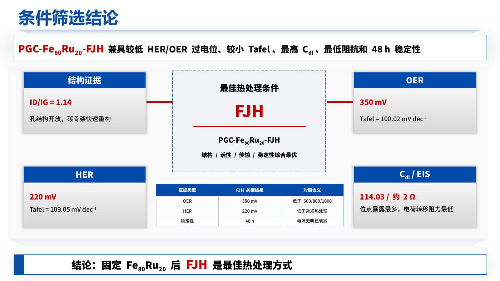

# AI PPT Review Assistant

AI PPT Review Assistant is a lightweight tool for checking whether a presentation is consistent with its source document.

It is designed for situations where a PowerPoint deck is created from an earlier draft, a report, a thesis, or several rounds of revisions. Before final delivery, the deck may still contain outdated statements, old project plans, inconsistent metrics, mismatched methods, or over-claimed conclusions. This project helps identify those issues page by page and produces a readable review report.

## What it does

Given a source document and a PPT file, the workflow can:

- extract slide titles and text content;
- identify outdated or risky expressions;
- flag possible inconsistencies between the PPT and the source material;
- classify slide-level issues by priority;
- generate an HTML report for manual review;
- provide suggested actions such as keep, revise, delete, or remake;
- optionally assist with PPT text-box cleanup when one sentence is split into many small text boxes.

## Example output



A sample review report is available here:

[examples/outputs/sample_review_report.html](examples/outputs/sample_review_report.html)

The report is organized in a page-level format:

```text
Slide page -> original content -> detected issue -> suggested revision -> priority
```

## Typical use cases

- thesis defense slides vs. final thesis document;
- project report vs. presentation deck;
- business proposal vs. pitch deck;
- course report vs. presentation slides;
- product requirement document vs. internal presentation.

## Screenshots

| Slide review | Result consistency |
|---|---|
|  |  |

| Conclusion check | Quality gate |
|---|---|
|  |  |

## Project structure

```text
ai-ppt-review-assistant/
├─ index.html
├─ README.md
├─ configs/
│  └─ risk_rules.yaml
├─ docs/
│  ├─ architecture.md
│  └─ workflow.md
├─ examples/
│  └─ outputs/sample_review_report.html
├─ assets/screenshots/
└─ src/ai_ppt_review_assistant/
   ├─ __init__.py
   └─ cli.py
```

## Quick start

This repository currently contains a minimal CLI prototype and a project demo page.

```bash
pip install -e .
ai-ppt-review path/to/slides.pptx --out review_report.html
```

The current CLI prototype focuses on extracting PPT text and flagging risk terms. The broader workflow design is documented in `docs/workflow.md` and `docs/architecture.md`.

## Technical notes

- `python-pptx` is used for PPT text extraction.
- `python-docx` can be used for source document parsing.
- risk rules are configurable in `configs/risk_rules.yaml`.
- reports are generated as standalone HTML files.
- OpenXML-level handling can be used when preserving rich text styles in PPT editing tasks.

## License and third-party notices

The project code is released under the MIT License. Third-party dependency licenses are summarized in [`THIRD_PARTY_NOTICES.md`](THIRD_PARTY_NOTICES.md).

Demo screenshots and sample reports are included for project explanation only. See [`ASSET_NOTICE.md`](ASSET_NOTICE.md).

## Privacy note

This repository only contains demo screenshots, sample reports, and code skeletons. It does not include any private thesis, report, school template, or original presentation file.

