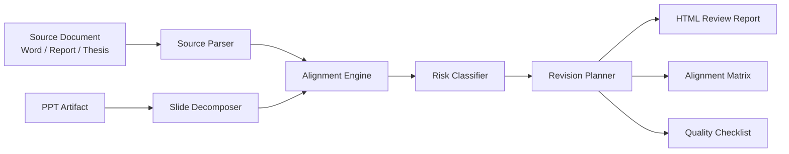

# Architecture

## Modules

1. **Source Parser**  
   Extracts title, chapter structure, research route, metrics, conclusions and keywords from the authoritative source document.

2. **Slide Decomposer**  
   Extracts each slide's title, text boxes, tables, charts and visual notes.

3. **Alignment Engine**  
   Maps slide content back to source document sections.

4. **Risk Classifier**  
   Detects content mismatches, old-version residues, outdated expressions, wrong methods, over-claiming and missing conclusions.

5. **Revision Planner**  
   Generates page-level actions: keep, revise, delete or remake.

6. **Report Generator**  
   Produces human-readable HTML reports for review and handoff.
